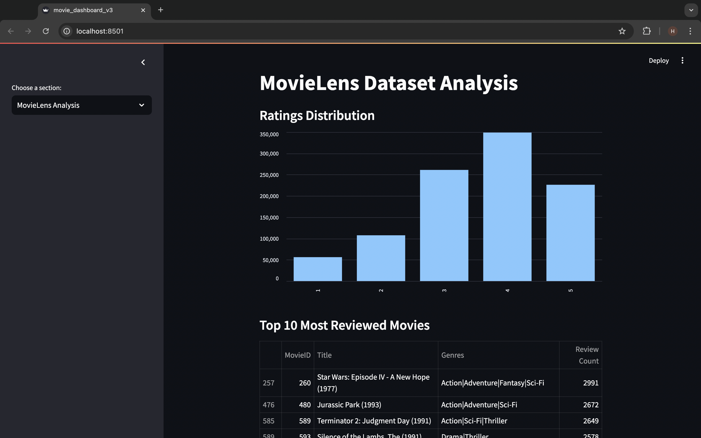
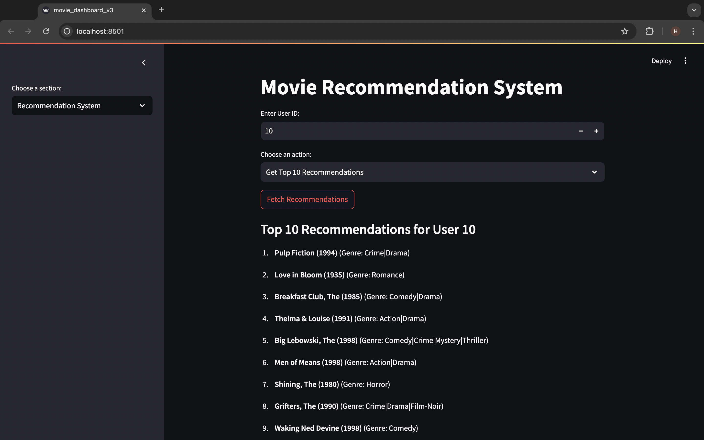

# **Big Data Project: Movie Recommendation System**

This project implements a movie recommendation system using a self-trained NCF deep learning model and a user-friendly Streamlit dashboard. The system utilizes SQL databases to store movie data, user ratings, and recommendations obtained trained NCF deep learning model for efficient querying.
Training of deep learning model is made scalable by utilising apache spark framework.

---
## MovieLens Dashboard

### MovieLens Dataset Analysis


### Movie Recommendation System


---
## **Technologies and Libraries Used**

The project utilizes the following technologies and libraries:

### **Programming Languages**
- **Python**: Core language for implementing the recommendation system, data processing, and dashboard.

### **Data Analysis and Visualization**
- **Pandas**: For data manipulation and analysis.
- **NumPy**: For numerical operations and array handling.
- **Matplotlib**: For creating static, animated, and interactive visualizations.
- **Seaborn**: For statistical data visualization.

### **Machine Learning and Deep Learning**
- **PyTorch**: For building and training the Neural Collaborative Filtering (NCF) model.
- **PyTorch Lightning**: For simplifying PyTorch training loops and improving scalability.
- **Scikit-learn**: For dataset splitting and pre-processing.

### **Big Data**
- **Apache Spark**: For handling and processing large-scale datasets using Spark SQL and DataFrames.

### **Web Frameworks**
- **Streamlit**: For building an interactive, web-based dashboard.

### **Database**
- **SQLite**: For storing user data, movie data, and precomputed recommendations.

### **Utilities**
- **TQDM**: For displaying progress bars during computations.
- **OS Module**: For file and path manipulations.

---

## **Project Structure**

- **`ml-1m/`**:
  - Directory containing the MovieLens 1M dataset.
  - Refer to the `README` file in this folder for dataset details.
- **`BigData_Project_v4.ipynb`**:
  - Jupyter notebook for training the Neural Collaborative Filtering (NCF) model.
  - The trained model weights are saved as `mrs-v4.pkl`.
- **`movie_recommendation.db`**:
  - SQLite database storing the `movies`, `ratings`, and `recommendations` tables.
- **`movie_dashboard_v3.py`**:
  - Streamlit dashboard script for interacting with the recommendation system.
- **`load_data_to_sql.py`**:
  - Script for loading the dataset into the SQLite database.
- **`create_views.py`**:
  - Script for creating reusable SQL views to speed up dashboard queries.
- **`precompute_recommendations.py`**:
  - Script to precompute and store the top 10 movie recommendations for all users.

---

These technologies and libraries work together to create a robust and scalable recommendation system and data analysis dashboard.

## **Setup Instructions**

### **1. Clone the Repository**
```bash
git clone https://github.com/HARSHALK2598/BigDataProject.git
cd BigDataProject
```
### **2. Install Dependencies**
Ensure you have Python 3.8+ installed. Then, use the `requirements.txt` file to install dependencies:

```bash
pip install -r requirements.txt
```
### **3. Create SQL Views**
Run the `create_views.py` script to create views that optimize dashboard queries:

```bash
python create_views.py
```
### **4. Precompute Recommendations**
Run the `precompute_recommendations.py` script to generate and store the top 10 recommendations for all users in the database:
```bash
python precompute_recommendations.py
```
---

## **5. Run the Streamlit Dashboard**
Launch the dashboard to explore movie recommendations and data analysis:
```bash
streamlit run movie_dashboard_v3.py
```
---

## **Features**

### **MovieLens Analysis**
- Visualize rating distributions.
- View top 10 rated movies and most reviewed movies.
- Analyze average ratings by genre and review count.

### **Recommendation System**
- Get personalized movie recommendations for any user.
- View the top 10 highest-rated movies based on user ratings.

---

## **Usage Notes**
- The database (`movie_recommendation.db`) stores all tables and views used by the dashboard.
- Ensure the dataset (`ml-1m`) and pre-trained model (`mrs-v4.pkl`) are present in the project directory.

---

## **License**
This project is licensed under the MIT License. See the `LICENSE` file for details.


